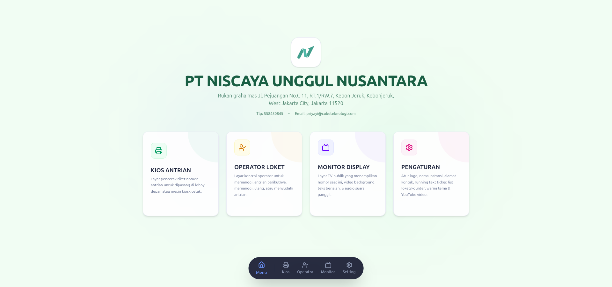

<div align="center">
  
  <h1 align="center">Sistem Antrian Niscaya</h1>
  <p align="center">
    Aplikasi manajemen antrian berbasis web modern untuk instansi, klinik, bank, dan layanan publik.
    <br />
    <strong>Docker · React · Express · TypeScript</strong>
  </p>
</div>

---

## Tentang Aplikasi

Sistem Antrian Niscaya adalah aplikasi manajemen antrian digital yang dirancang untuk menggantikan sistem antrian kertas/conventional. Aplikasi ini menyediakan empat panel utama yang terintegrasi penuh:

- **Kios Mandiri** — Pengambilan nomor antrian secara otomatis dengan cetak tiket
- **Panel Operator** — Panggilan nomor antrian per loket dengan kontrol penuh
- **Monitor Display** — Tampilan TV publik dengan nomor antrian, video, running text, dan suara panggilan
- **Pengaturan** — Konfigurasi branding, warna, loket, printer, dan media

## Fitur Utama

| Fitur | Deskripsi |
|-------|-----------|
| 🖨️ **Cetak Tiket** | Cetak tiket antrian otomatis via browser, Windows Local, atau Fully Kiosk |
| 🔊 **Panggilan Suara** | Announcement otomatis dengan suara Google TTS / ResponsiveVoice (Indonesian Female) |
| 📺 **Monitor Display** | Tampilan TV dengan nomor antrian, video YouTube, running text, dan jam real-time |
| 🎨 **Kustomisasi Branding** | Ubah logo, warna tema, hero image, dan teks running |
| 🎭 **Tema Adaptif** | Seluruh halaman (termasuk Pengaturan) mengikuti tema warna terpilih dengan penyesuaian gelap/terang otomatis |
| 🔄 **Real-time** | Update nomor antrian secara real-time via polling |
| 🐳 **Docker Support** | Deploy sekali dengan Docker Compose, siap digunakan |
| 🔐 **HTTPS Ready** | Dukungan SSL self-signed untuk koneksi aman |

## Teknologi

| Stack | Teknologi |
|-------|-----------|
| **Frontend** | React 19, TypeScript, Tailwind CSS v4, Vite |
| **Backend** | Node.js, Express, TypeScript |
| **Database** | JSON file-based storage (local) |
| **Container** | Docker, Docker Compose, Nginx reverse-proxy |

## Screenshots

<div align="center">
  <table>
    <tr>
      <td align="center"><br/><b>Halaman Utama</b></td>
      <td align="center"><br/><b>Kios Ambil Nomor</b></td>
    </tr>
    <tr>
      <td align="center"><br/><b>Panel Operator Loket</b></td>
      <td align="center"><br/><b>Monitor Display Publik</b></td>
    </tr>
    <tr>
      <td align="center" colspan="2"><br/><b>Pengaturan & Kustomisasi</b></td>
    </tr>
  </table>
</div>

## Panduan Deploy

### Prasyarat

- Docker & Docker Compose terinstal
- Port 80 dan 443 tersedia

### Instalasi (Pertama Kali)

```bash
git clone https://github.com/anomalyco/software-antrian-kiosv2.git
cd software-antrian-kiosv2
chmod +x deploy.sh
./deploy.sh
```

Atau secara manual:

```bash
docker compose up -d --build
```

Akses aplikasi di **http://localhost**

### Penggunaan Sehari-hari

```bash
# Menyalakan
./start.sh

# Mematikan
./stop.sh
```

### Mode Development

```bash
npm install
npm run dev
```

Akses di **http://localhost:3000**

## Struktur Direktori

```
├── src/                  # Kode sumber frontend & backend
│   ├── App.tsx           # Komponen utama React
│   ├── server/           # Server Express
│   └── types.ts          # Tipe TypeScript
├── public/               # Aset statis
├── assets/               # Sumber daya (favicon, dll)
├── storage/              # Data runtime (tidak di-commit)
├── ssl/                  # Sertifikat SSL (tidak di-commit)
├── docker-compose.yml    # Orkestrasi container
├── Dockerfile            # Build image
├── nginx.conf            # Reverse-proxy Nginx
└── deploy.sh             # Script deploy otomatis
```

## Konfigurasi

### Panel Pengaturan

Setelah login, buka menu **Pengaturan** (bottom nav) untuk mengonfigurasi:

- **Profil Instansi** — Nama, alamat, telepon, email
- **Logo** — Upload logo instansi
- **Hero Image** — Background image untuk halaman utama
- **Running Text** — Teks berjalan di monitor display
- **Video YouTube** — ID video untuk latar monitor
- **Warna Tema** — Header, tombol, background, teks
- **Loket** — Tambah/hapus loket pelayanan
- **Printer** — Metode cetak tiket (browser / Windows / Fully Kiosk)

> **Tema Adaptif:** Halaman Pengaturan otomatis mengikuti tema warna yang dipilih (Header, tombol/aksen, dan background dari tema). Panel ini menyesuaikan antara tampilan terang dan gelap secara otomatis berdasarkan warna background tema, sehingga konsisten dengan halaman Home, Kiosk, Operator, dan Monitor untuk semua preset tema.

## Lisensi

Hak cipta © 2024 PT Niscaya. All rights reserved.
